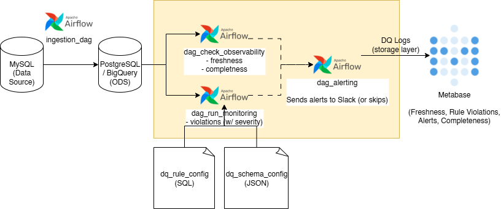
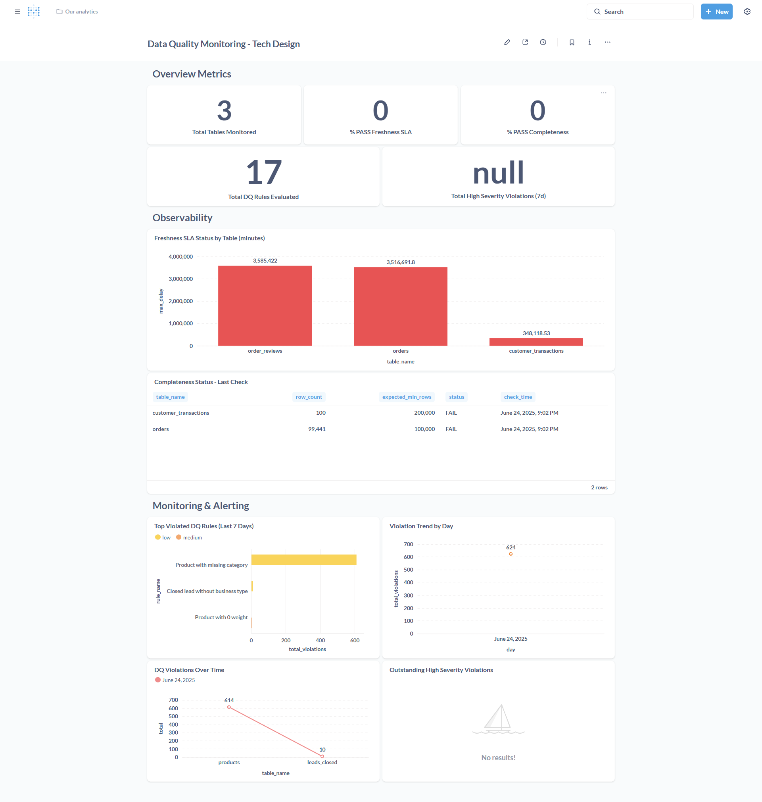

<h1 align="center">🔧 Data Quality Platform Template — Airflow × Postgres</h1>
<p align="center">Observability (freshness/completeness), rule-based Monitoring, and pluggable Alerting — orchestrated with <b>Apache Airflow</b>, logged in <b>PostgreSQL</b>, and visualized in <b>Metabase</b>. JSON & SQL configs for schema-aware validation.</p><br>
<p align="center">
  
  <a href="https://github.com/caesarmario">
    
  </a>
  <a href="https://beacons.ai/caesarmario_">
    
  </a>
  <a href="https://www.kaggle.com/caesarmario">
    
  </a>
</p>
<br>


A modular, config-driven **Data Quality (DQ) platform** implementing 3 core capabilities:

- **Observability** — SLA-aware freshness & completeness checks with historical “SKIPPED” logic  
- **Monitoring** — declarative SQL rules with **dynamic schema casting** (JSON-typed)  
- **Alerting** — grouped, severity-based alerts (Slack-style; easily extensible to Telegram/Email)

It aligns with DAMA dimensions (Accuracy, Completeness, Consistency, Uniqueness, Timeliness, Validity) and is production-minded (idempotent tasks, retries, environment separation).

---

## 📃 Table of Contents
- [Tech Stack](#tech-stack)
- [Features](#features)
- [Architecture](#architecture)
- [Repository Structure](#repository-structure)
- [Quickstart](#quickstart)
  - [1) Prerequisites](#1-prerequisites)
  - [2) Environment](#2-environment)
  - [3) Bring up the stack](#3-bring-up-the-stack)
  - [4) Airflow Variables (UI → Admin → Variables)](#4-airflow-variables-ui--admin--variables)
  - [5) Run DAGs (order)](#5-run-dags-order)
- [Main Modules](#-main-modules)
- [Schema-Aware Config (example)](#-schema-aware-config-example)
- [Data & DQ Schemas](#-data--dq-schemas)
- [Monitoring & Dashboards](#monitoring--dashboards)
- [Acknowledgements](#acknowledgements)
- [Support me!](#support-me)

---

## 🔧 Tech Stack

- **Apache Airflow** (orchestration)
- **PostgreSQL** (ODS staging + DQ logs)
- **Python** (observability/monitoring/alerting logic)
- **Metabase** (dashboarding)
- **Slack** (mocked alert target; channels are pluggable)

---

## ✅ Features

- **Observability**
  - Freshness: SLA latency since last update (per table)
  - Completeness: row-count thresholds
  - `PASS` / `FAIL` / `SKIPPED` (for intentionally historical datasets)

- **Monitoring**
  - Rules live in `tmt_dq.dq_rule_config` (SQL metatable)
  - Validation queries are COUNT-based; results logged to `dq_violations`
  - **Dynamic casting** using `config/dq_schema_config.json` to avoid type/operator mismatches

- **Alerting**
  - Grouped by table, only **High/Critical** with `alert_sent=false`
  - Slack webhook demo; easily extend to Telegram/Email

- **Dashboard**
  - Overview metrics, SLA freshness bars, completeness table, top violated rules, violation trends, outstanding high-severity

- **Extensible by config**
  - Add tables/columns → update JSON typing
  - Add rules → upsert SQL rows; no code changes required

---

## 🗺 Architecture
<p align="center">
  
</p>

---

## 📂 Repository Structure
```
tech-design-test-case/
├─ airflow/
│  ├─ dags/
│  │  ├─ dag_dq_check.py
│  │  └─ dag_dq_load_source.py
│  └─ plugins/
│     ├─ dq_utils/
│     │  ├─ alerting.py
│     │  ├─ monitoring.py
│     │  └─ observability.py
│     ├─ load_utils.py
│     └─ logging_utils.py
├─ assets/
│  ├─ data_framework_mario_caesar.drawio
│  ├─ data_framework_mario_caesar.drawio.png
│  ├─ data_monitoring_ss.png
│  ├─ dq_rule_queries.sql
│  └─ metabase_query.sql
├─ config/
│  └─ dq_schema_config.json
├─ data/
│  ├─ customer_transactions.csv
│  └─ olist.sqlite
├─ .env
├─ .gitignore
├─ dev_notes.txt
├─ docker-compose.yml
├─ Dockerfile
├─ README.md
└─ requirements.txt
```

---

---

## 🚀 Quickstart

### 1) Prerequisites
- Docker & Docker Compose
- Ports available: `8084` (Airflow), `5436` (Postgres), `3000` (Metabase)

### 2) Environment
Create a `.env` file (or edit existing):
```env
POSTGRES_USER=postgres
POSTGRES_PASSWORD=postgres
POSTGRES_DB=postgres
POSTGRES_PORT=5436
SLACK_WEBHOOK_URL=https://hooks.slack.com/services/your/dummy/webhook   # optional demo
```

### 3) Bring up the stack
```bash
docker compose up -d --build
# Airflow: http://localhost:8084
# Metabase: http://localhost:3000
```

### 4) Airflow Variables (UI → Admin → Variables)
Set variables as needed by your DAGs/utils, for example:
- `DQ_SCHEMA_CONFIG_PATH` → `/opt/airflow/config/dq_schema_config.json`
- `DB_CONN_ID` → `postgres_default` (or your custom connection)
- `FRESHNESS_SLA_MINUTES` → `4320` (3 days) — example default
> Also configure **Connections** (Admin → Connections) for Postgres if not using defaults.

### 5) Run DAGs (order)
1. `dag_dq_load_source`
Loads `olist.sqlite` and `customer_transactions.csv` into schema `tmt`; then triggers…
2. `dag_dq_check`
Runs: **freshness** → **completeness** → **monitoring** → **alerting**.
Logs go to `tmt_dq` schema.

---
## 🔩 Main Modules
- `observability.py`
    - Computes table freshness vs SLA, completeness vs expected thresholds
    - Writes time-series logs:
        - `tmt_dq.dq_freshness_log(table_name, last_updated, delay_minutes, status, check_time)`
        - `tmt_dq.dq_completeness_log(table_name, row_count, expected_min_rows, status, check_time)`
- `monitoring.py`
    - Reads `tmt_dq.dq_rule_config(rule_id, rule_name, table_name, rule_sql, severity)`
    - Applies **JSON-typed casting** before running `rule_sql`
    - Writes `tmt_dq.dq_violations(table_name, rule_id, rule_name, violation_count, severity, alert_sent, check_time)`
- `alerting.py`
    - Aggregates **High/Critical** where `alert_sent=false`
    - Sends a grouped Slack message (pluggable) and marks as sent
- `load_utils.py`
    - Idempotent DDL + fast COPY/insert flows for SQLite/CSV to Postgres

---
## 🧬 Schema-Aware Config (example)

`config/dq_schema_config.json` (excerpt):
```json
{
  "customer_transactions": {
    "transaction_id": "INTEGER",
    "customer_id": "TEXT",
    "transaction_date": "TEXT",
    "amount": "REAL",
    "category": "TEXT",
    "location": "TEXT"
  },
  "order_reviews": {
    "review_id": "TEXT",
    "order_id": "TEXT",
    "review_score": "INTEGER",
    "review_creation_date": "TEXT"
  }
}
```

Typical rule rows (see `assets/dq_rule_queries.sql`):
```sql
INSERT INTO tmt_dq.dq_rule_config(rule_id, rule_name, table_name, rule_sql, severity)
VALUES
(1, 'amount_non_negative', 'customer_transactions',
 'SELECT COUNT(*) FROM tmt.customer_transactions WHERE COALESCE(amount,0) < 0', 'medium'),
(2, 'review_score_1_5', 'order_reviews',
 'SELECT COUNT(*) FROM tmt.order_reviews WHERE review_score NOT BETWEEN 1 AND 5', 'high');
```

---
## 🗄 Data & DQ Schemas
- **ODS / Staging:** `tmt.*` (loaded from SQLite/CSV)
- **DQ Metadata & Logs:** `tmt_dq.*`
    - `dq_rule_config` — rule registry (COUNT-based checks)
    - `dq_freshness_log`, `dq_completeness_log` — observability
    - `dq_violations` — per-rule violations + `alert_sent` flag

---
## 📊 Monitoring & Dashboards
Use `assets/metabase_query.sql` to create cards:
- **Overview**: total tables monitored, % pass freshness/completeness, total rules evaluated, total high-severity
- **Observability**: freshness SLA by table (bar), completeness last check (table)
- **Monitoring**: top violated rules (7d), violation trend by day, violations over time
- **Alerts**: outstanding high-severity (where `alert_sent=false`)

Example screenshot:

<p align="center">  </p>

---
## 🙏 Acknowledgements
- Public **Olist** datasets for mock relational shapes
- Community tools: Airflow, Postgres, Metabase, Slack SDKs

---
## 🙌 Support me!

👉 If you find this project useful, **please ⭐ this repository 😆**!
---

👉 _More about myself: <a href="https://linktr.ee/caesarmario_"> here </a>_
